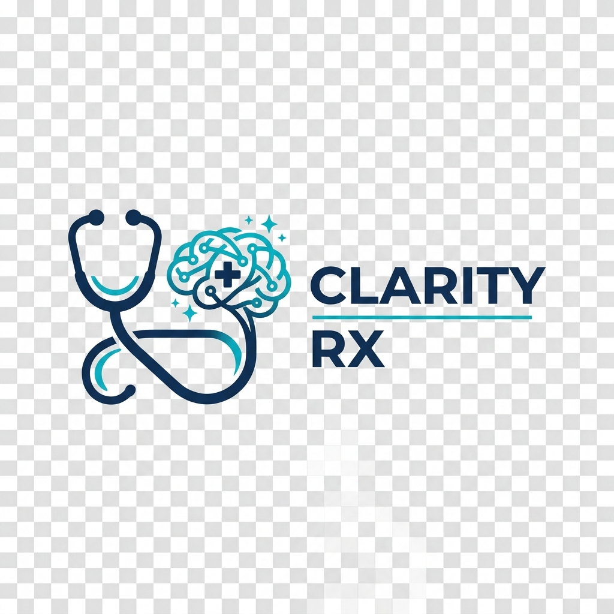
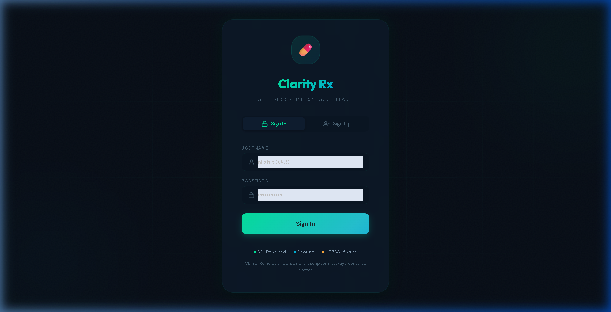
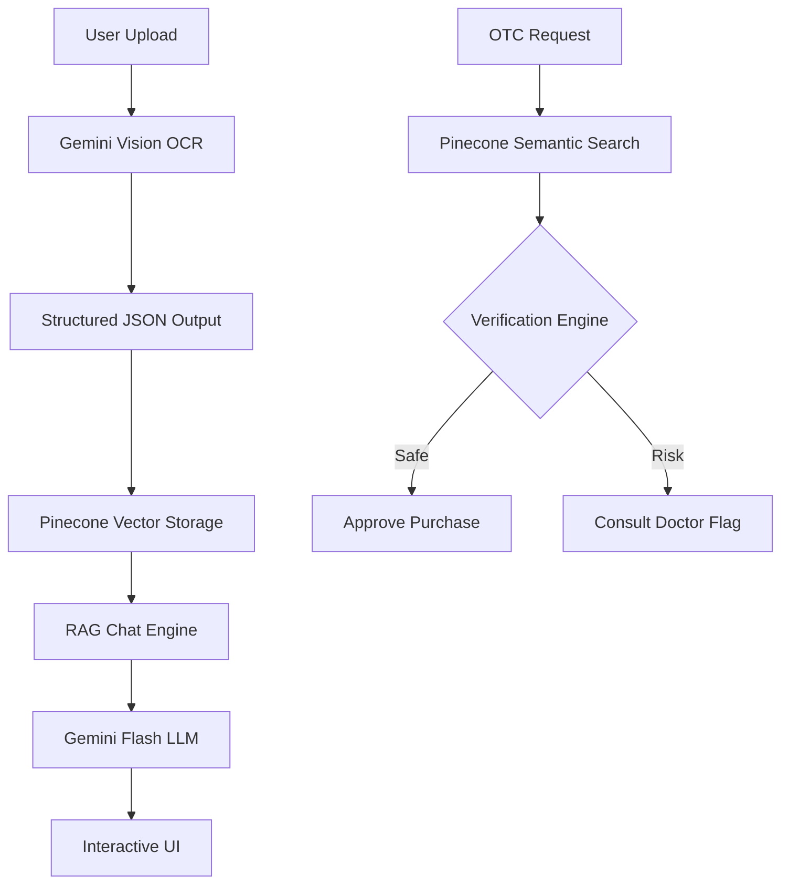

<div align="center">
  
  <h1>Clarity Rx</h1>
  <p><strong>Intelligent Prescription RAG Assistant with OTC Safety Verification</strong></p>

  <p>
    
    
    
    
  </p>
</div>

---

## 🌟 Overview

**Clarity Rx** is a professional-grade medical assistant designed to bridge the gap between complex medical prescriptions and patient understanding. By leveraging state-of-the-art **RAG (Retrieval-Augmented Generation)** architecture, Clarity Rx digitizes handwritten prescriptions and provides a secure, interactive environment for patients to understand their medication schedules and verify the safety of over-the-counter (OTC) purchases.



## ✨ Key Features

### 🔍 Precision Prescription OCR
- **Advanced Vision Extraction**: Uses Google Gemini Vision to accurately parse handwritten and digital prescriptions.
- **Structured Data Generation**: Translates physician handwriting into clear, structured dosage, timing, and frequency instructions.

### 💬 Intelligent Medical Chat (RAG)
- **Context-Aware Reasoning**: Ask complex questions about side effects, food interactions, or timing.
- **Patient History Memory**: Remembers past prescriptions to provide holistic advice within a single session.

### 🛡️ OTC Safety Guard
- **Semantic Verification**: Utilizes Pinecone vector search to verify if a medicine is safe for OTC purchase or requires a professional consultation.
- **Drug Interaction Awareness**: Cross-references OTC requests with active prescriptions to prevent adverse reactions.

---

## 🏗️ Architecture



---

## 🚀 Getting Started

### Prerequisites
- **Python**: 3.10+
- **Node.js**: 18.0+
- **MongoDB**: Atlas or Local Instance
- **Pinecone**: API Key and Index (`prescription-index`)
- **Google Cloud**: Gemini API Key

### Installation

1. **Clone & Setup Backend**
   ```bash
   # Root directory
   pip install -r requirements.txt
   ```

2. **Setup Frontend**
   ```bash
   cd frontend
   npm install
   ```

3. **Configuration**
   Create a `.env` in the root directory:
   ```env
   GOOGLE_API_KEY=your_key
   PINECONE_API_KEY=your_key
   MONGO_URI=your_mongo_connection_string
   ```

### Running the Application
- **Backend**: `python server.py` (Runs on port 8000)
- **Frontend**: `cd frontend && npm run dev` (Runs on port 5173)

---

## 🛠️ Tech Stack

| Component | Technology |
|---|---|
| **Frontend** | React, Vite, Tailwind CSS (Surgical-Med UI) |
| **Backend** | FastAPI (Python) |
| **AI / LLM** | Google Gemini 1.5 Flash |
| **Vector Database** | Pinecone |
| **Primary Database** | MongoDB |
| **Orchestration** | LangGraph, LangChain |

---

## 📜 License
Distributed under the **MIT License**. See `LICENSE` for more information.

---

## ⚠️ Disclaimer
**Clarity Rx is NOT a substitute for professional medical advice.** Always consult with a qualified healthcare provider before making medical decisions or changing medication. This tool is provided for informational and educational purposes only.

---

<div align="center">
  <sub>Built with ❤️ for better patient health management.</sub>
</div>
