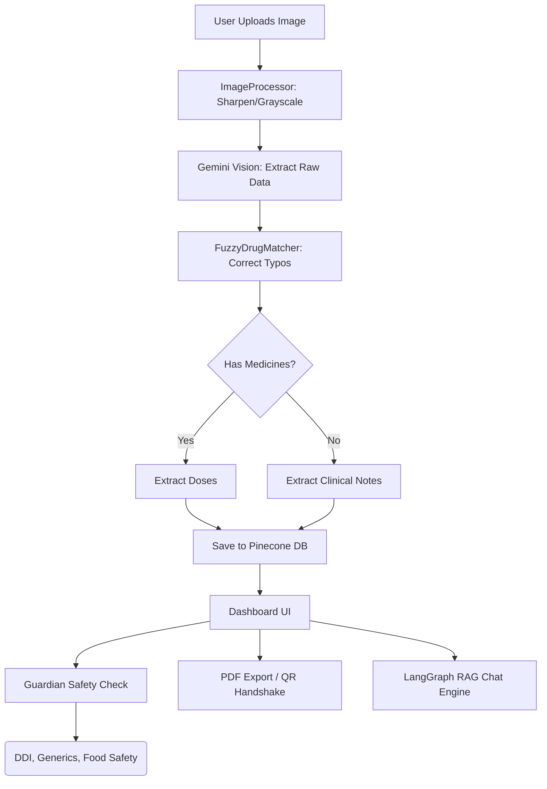

<div align="center">
  
  <h1>Clarity Rx 5.0 (The Guardian)</h1>
  <p><strong>Intelligent Prescription RAG Assistant & Guardian Safety Shield</strong></p>

  <p>
    
    
    
    
  </p>
</div>

---

## 🌟 Overview

**Clarity Rx** is a professional-grade medical assistant designed to bridge the gap between complex medical prescriptions and patient understanding. By leveraging state-of-the-art **RAG (Retrieval-Augmented Generation)** architecture, advanced machine vision, and the new **Guardian Safety Shield**, Clarity Rx translates illegible physician handwriting into structured details while actively guarding patients against drug interactions, generic upcharging, and lifestyle risks.


## ✨ Key Features (Updated for v5.0)

### 🔍 Vision AI & Extraction (v4.0 Update)
- **Advanced Preprocessing Pipeline**: Automatically de-blurs, sharpens, and enhances contrast of messy medical prescriptions.
- **Fuzzy Drug Matching**: Cross-references unreadable handwriting with medical databases to auto-correct typos (e.g., Amoxiln -> Amoxicillin).
- **Clinical Observation Support**: intelligently detects and extracts clinical notes even when "No Medicines" are prescribed.

### 🛡️ Guardian Safety Shield (New in v5.0)
- **DDI Checking**: AI-driven Drug-Drug Interaction alerts (Red Alerts for dangerous combos).
- **Generic Savings Finder**: Analyzes branded prescriptions and suggests up to 70% cheaper generic alternatives.
- **Food & Diet Safety**: Personalized instructions on what foods/drinks to avoid with specific medicines.
- **Side-Effects & Recovery**: Provides non-medical lifestyle tips and common side-effects to monitor.

### 📲 Patient Accessibility & Tools (New in v5.0 & v3.0)
- **PDF Export Generator**: One-click download of the "AI-Cleaned" medical report.
- **QR 'Pharmacist Handshake'**: A scannable QR code to instantly share extracted prescription text with your pharmacist.
- **Desktop Dose Reminders**: Browser-based notifications for intake times.
- **Visual Dosage Timeline**: 24-hour visual breakdown of medicine schedules.
- **Voice Output (Listen)**: Text-to-speech for visually impaired users.

### 💬 Intelligent Medical Chat (RAG)
- **Context-Aware Reasoning**: Ask complex questions about the prescription.
- **Patient History Memory**: Remembers past prescriptions for holistic advice.
- **OTC Verification**: Semantic search verifying if an OTC purchase is safe alongside current meds.

---

## 🏗️ Architecture Flow



---

## 🚀 Getting Started

### Prerequisites
- **Python**: 3.10+
- **Node.js**: 18.0+
- **Database**: MongoDB & Pinecone 
- **Google Cloud**: Gemini API Key

### Installation

1. **Clone & Setup Backend**
   ```bash
   pip install -r requirements.txt
   ```

2. **Setup Frontend**
   ```bash
   cd frontend
   npm install
   ```

3. **Configuration**
   Create a `.env` in the root directory:
   ```env
   GOOGLE_API_KEY=your_key
   PINECONE_API_KEY=your_key
   MONGO_URI=your_mongo_connection_string
   ```

### Running the Application
- **Backend**: `python server.py` (Runs on port 8000)
- **Frontend**: `cd frontend && npm run dev` (Runs on port 5173)

---

## 🛠️ Tech Stack

| Component | Technology |
|---|---|
| **Frontend** | React, Vite, CSS, jsPDF, qrcode.react |
| **Backend** | FastAPI (Python), Pillow (Image processing) |
| **AI / LLM** | Google Gemini 1.5 Pro/Flash |
| **Vector DB** | Pinecone |
| **State Mgmt** | MongoDB, LangGraph |

---

## 📜 License
Distributed under the **MIT License**. See `LICENSE` for more information.

---

## ⚠️ Disclaimer
**Clarity Rx is NOT a substitute for professional medical advice.** Always consult with a qualified healthcare provider before making medical decisions or changing medication. This tool is provided for informational and educational purposes only.

---

<div align="center">
  <sub>Built with ❤️ for better patient health management.</sub>
</div>
