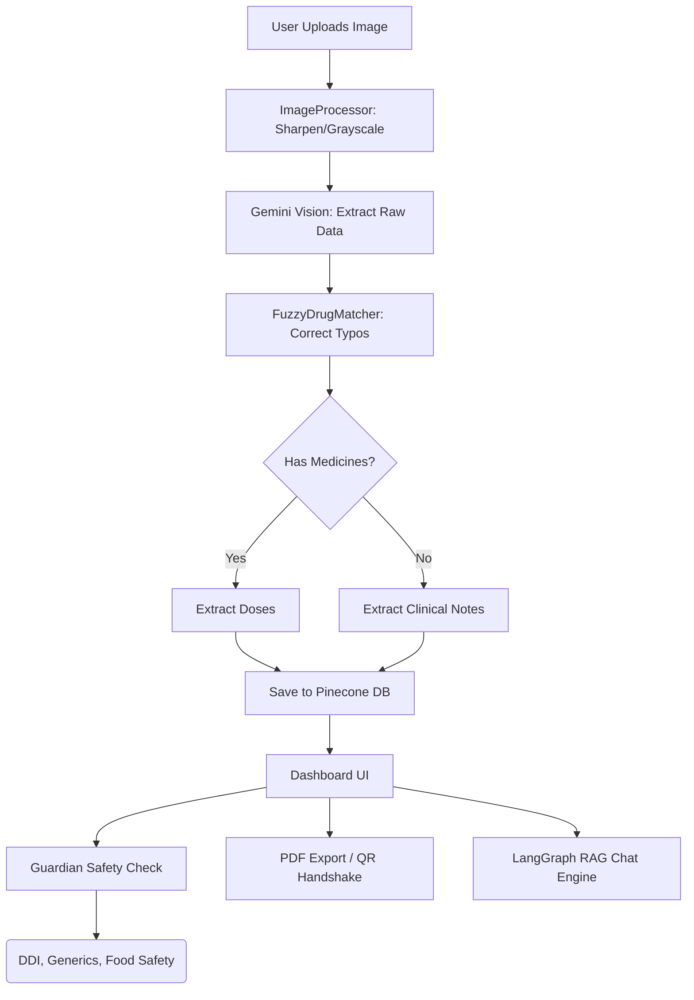

<div align="center">
  
  <h1>Clarity Rx (The Guardian)</h1>
  <p><strong>Professional Medical AI & Clinical Safety Intelligence</strong></p>

  <p>
    
    
    
  </p>
</div>

---

## 🌟 Overview

**Clarity Rx** is a premium, clinical-grade medical assistant that bridges the gap between complex prescriptions and patient safety. Re-engineered with a high-fidelity "Bioluminescent" medical interface, it leverages state-of-the-art **Vision AI** to translate messy physician handwriting while actively shielding patients from drug-drug interactions (DDI), medication risks, and lifestyle complications.

### 🎨 High-Fidelity UI/UX
- **Bioluminescent Interface**: Modern medical theme featuring pulsing "Pulse" animations and emerald glowing accents.
- **AI Typewriter Chat**: Intelligent character-by-character response rendering for better clinical consultation flow.
- **Guardian Command Center**: Redesigned dashboard with a clear primary/secondary action hierarchy for critical patient tasks.
- **Neural Upload Zone**: Interactive drag-and-drop file processing with holographic scanning effects.

### 🔍 Vision AI & Extraction
- **Advanced Preprocessing Pipeline**: Automatically de-blurs, sharpens, and enhances contrast of medical prescriptions.
- **Fuzzy Drug Matching**: Cross-references unreadable handwriting with clinical databases to auto-correct typos.
- **Clinical Metadata**: intelligently detects and extracts clinical notes even when "No Medicines" are prescribed.

### 🛡️ Guardian Safety Shield
- **DDI Checking**: AI-driven Drug-Drug Interaction alerts with critical risk indicators.
- **Generic Savings Finder**: Suggests cost-effective generic alternatives for branded medications.
- **Food & Diet Safety**: Personalized alerts on food/drink interactions for specific medications.
- **Recovery & Lifestyle**: Evidence-based wellness tips and common side-effect tracking.

### 📲 Patient Tools
- **PDF Export**: Generate professional "AI-Cleaned" reports for discharge or records.
- **QR Handshake**: Instantly share extracted text with pharmacists via secure QR codes.
- **Dose Reminders**: Integrated browser-based intake notifications.
- **Dosage Timeline**: 24-hour visual breakdown of complex medicine schedules.

---

## 🏗️ Architecture Flow



---

## 🚀 Getting Started

### Prerequisites
- **Python**: 3.10+
- **Node.js**: 18.0+
- **Database**: MongoDB & Pinecone 
- **Google Cloud**: Gemini API Key

### Installation

1. **Clone & Setup Backend**
   ```bash
   pip install -r requirements.txt
   ```

2. **Setup Frontend**
   ```bash
   cd frontend
   npm install
   ```

3. **Configuration**
   Create a `.env` in the root directory:
   ```env
   GOOGLE_API_KEY=your_key
   PINECONE_API_KEY=your_key
   MONGO_URI=your_mongo_connection_string
   ```

### Running the Application
- **Backend**: `python server.py` (Runs on port 8000)
- **Frontend**: `cd frontend && npm run dev` (Runs on port 5173)

---

## 🛠️ Tech Stack

| Component | Technology |
|---|---|
| **Frontend** | React, Vite, CSS, jsPDF, qrcode.react |
| **Backend** | FastAPI (Python), Pillow (Image processing) |
| **AI / LLM** | Google Gemini 1.5 Pro/Flash |
| **Vector DB** | Pinecone |
| **State Mgmt** | MongoDB, LangGraph |

---

## 📜 License
Distributed under the **MIT License**. See `LICENSE` for more information.

---

## ⚠️ Disclaimer
**Clarity Rx is NOT a substitute for professional medical advice.** Always consult with a qualified healthcare provider before making medical decisions or changing medication. This tool is provided for informational and educational purposes only.

---

<div align="center">
  <sub>Built with ❤️ for better patient health management.</sub>
</div>
