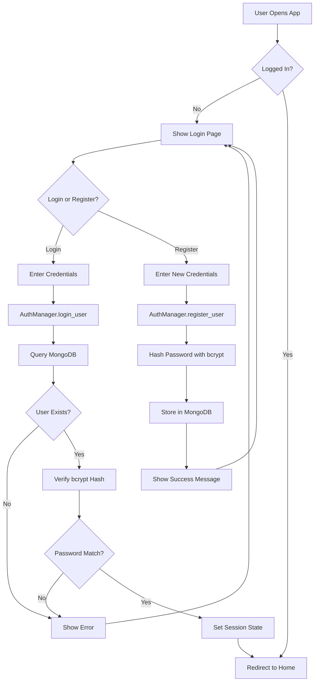
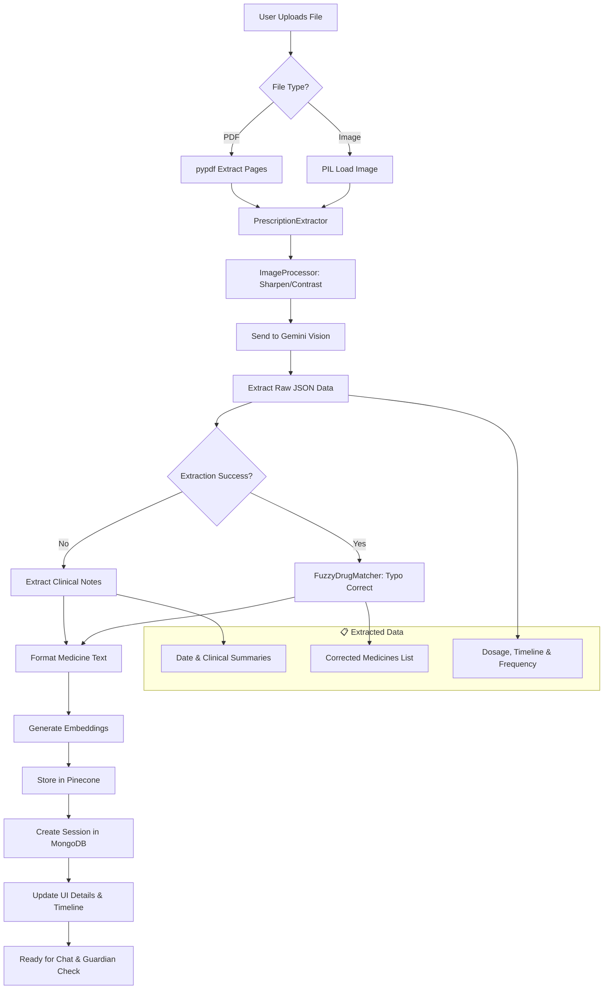
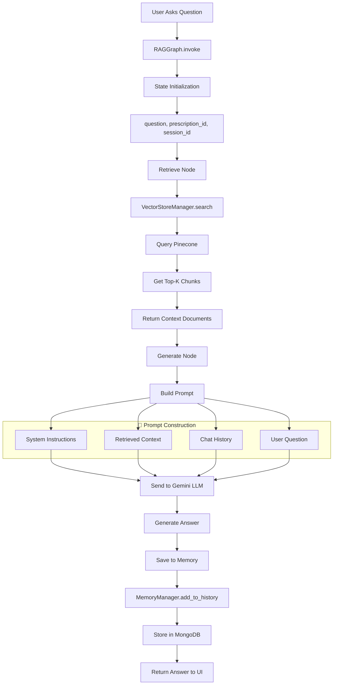
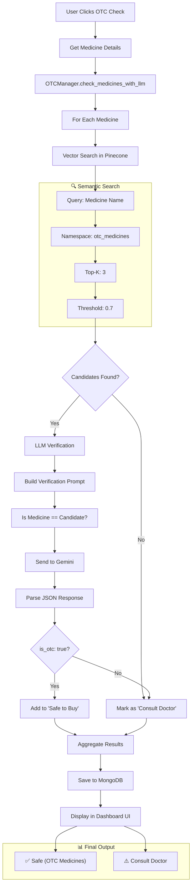
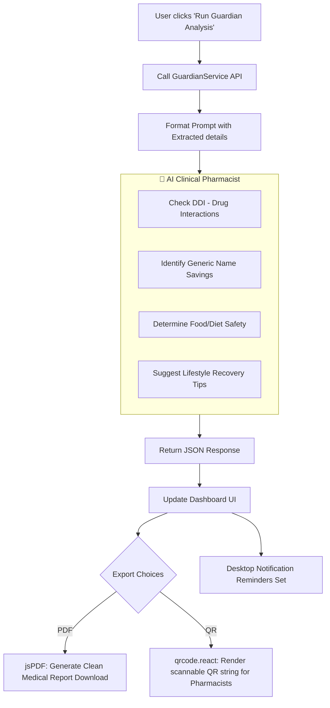
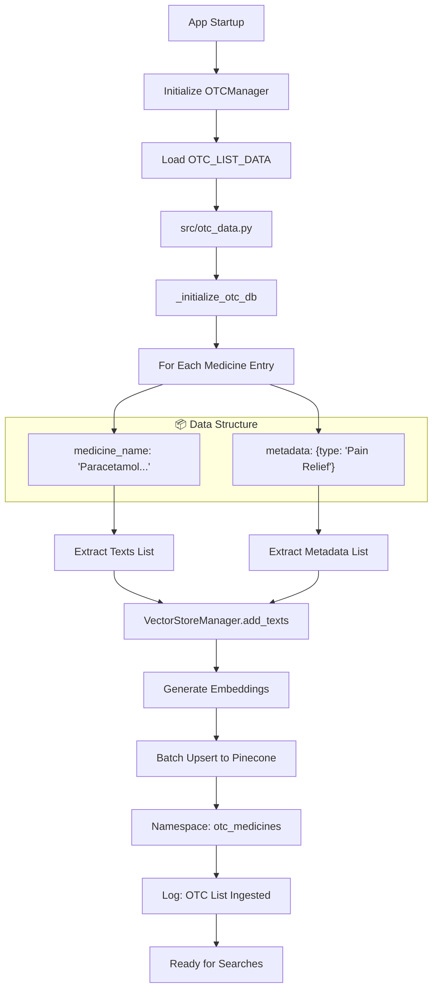
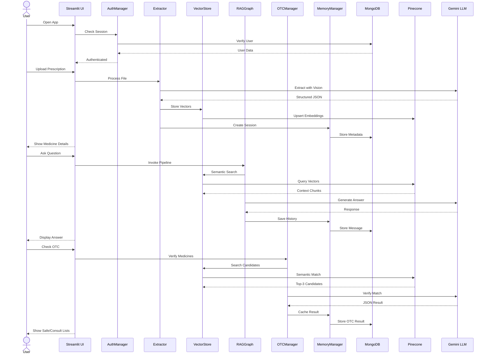

# Clarity Rx: Detailed Workflow Diagrams

## 1. High-Level System Overview

```mermaid
flowchart TB
    subgraph User["👤 User"]
        A[Upload Prescription]
        B[Ask Question]
        C[Check OTC Safety]
    end
    
    subgraph Frontend["🖥️ React/Vite Frontend"]
        D[Dashboard.jsx UI]
        D1[QR Code Generator]
        D2[PDF Generator]
    end
    
    subgraph Backend["⚙️ Backend FastAPI Services"]
        E[AuthManager]
        F[PrescriptionExtractor]
        F1[ImageProcessor & Fuzzy Matcher]
        G[RAGGraph (LangChain)]
        H[OTCManager]
        I[MemoryManager]
        J[VectorStoreManager]
        X[GuardianService]
    end
    
    subgraph External["☁️ External Services"]
        K[(MongoDB)]
        L[(Pinecone)]
        M[Google Gemini]
    end
    
    A --> D
    B --> D
    C --> D
    D --> E
    D --> F
    D --> G
    D --> H
    D --> X
    F --> F1
    F1 --> M
    X --> M
    E --> K
    G --> J
    G --> M
    G --> I
    H --> J
    H --> M
    I --> K
    J --> L
```

---

## 2. Authentication Flow



---

## 3. Prescription Upload & Processing



---

## 4. RAG Chat Pipeline (LangGraph)



---

## 5. OTC Safety Verification (Hybrid RAG)



---

## 5.1. Guardian Safety Shield & Export Flow (v5.0)



---

## 6. OTC Database Initialization (Startup)



---

## 7. Complete User Journey



---

## 8. Data Flow Summary

| Step | Component | Input | Output | Storage |
|------|-----------|-------|--------|---------|
| 1 | AuthManager | Username/Password | Session Token | MongoDB |
| 2 | ImageProcessor | Raw Image | Sharpened/Contrast Image | RAM |
| 3 | Extractor | PDF/Image | Structured JSON / Clinical Notes | - |
| 4 | FuzzyMatcher | Rough JSON | FDA Corrected Names | - |
| 5 | VectorStore | Text Chunks | Embeddings | Pinecone |
| 6 | GuardianService | Medicine List | DDI, Generics, Food Safety | - |
| 7 | OTCManager | Medicine List | Safety Classification | MongoDB (cached) |
| 8 | UI Layer | JSON Data | Rendered Timeline, PDF, QR | Client Browser |
